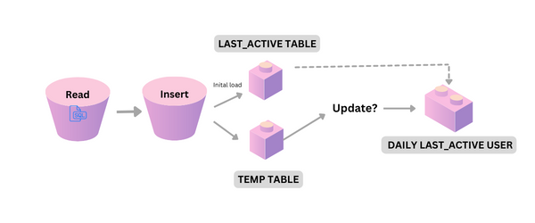

# Last Active User ETL upsert method

Description: 
I have learn two ways to proceed the upsert method (insert + update) with last_active_user metric through python and SQL. It serves with different purpose depend on the destination source. For example, we want to transfers the executed result from last_active_user to db. Through python, we can use temp_table to extract the latest active and insert it into the table using SQL (INSERT INTO DO UPDATE). 

## Process

##Context:

As explain in the description, our purpose is to get the lastest info about customer info and their active hours. So, we need a pipeline that could automate that task. 

Since the customer_active_hour table was already existed in the database, we can only using upsert method to update the table by its lastest day. However, the common step that we ussually see is manipulating the data using SQL and transfer to data warehouse for further analysis tools. Therefore, this is what we are doing here. 

We have our initial load till 27 June 2017 (as above) 

##Data source: (https://www.kaggle.com/datasets/jtrotman/user-achievements-snapshots)

