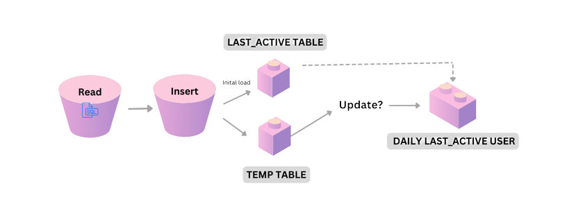
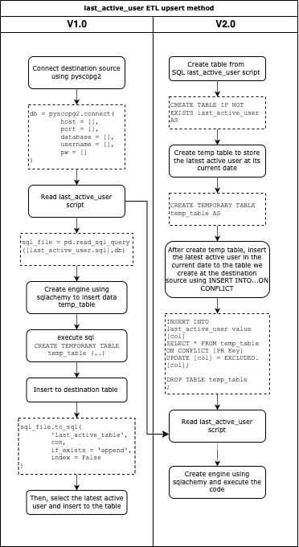

# Last Active User ETL upsert method

Description: 
I have learn two ways to proceed the upsert method (insert + update) with last_active_user metric through python and SQL. It serves with different purpose depend on the destination source. For example, we want to transfers the executed result from last_active_user to db. Through python, we can use temp_table to extract the latest active and insert it into the table using SQL (INSERT INTO DO UPDATE). 

## Process

### Story:
Upsert method is really demand for transactional data since it needs to be insert and update on a daily basis. However, the story that i have learn about it coming from two version that shown in the picture. Version 1 was consider the harder way as it need to be transform the sql script through python. If the source is in the same destination, it will be more workable to insert the update condition WITHIN the sql script just fine. (As shown in the v2)
Version 2 is the way we handle the upsert method using INSERT INTO DO UPDATE) ready within the script. Then we just need to use python to execute and read the query. It is shorter! (learn with optimize way from the boss, LOL)

