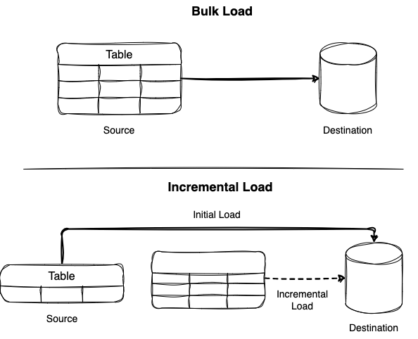

# Last Active User ETL upsert method

Description: 
I have learn two ways to proceed the upsert method (insert + update) with last_active_user metric through python and SQL. It serves with different purpose depend on the destination source. For example, we want to transfers the executed result from last_active_user to db. Through python, we can use temp_table to extract the latest active and insert it into the table using SQL (INSERT INTO DO UPDATE). 

## Bulk Load Vs Incremental Load

Bulk Load is when you load everything into your destination. Meanwhile, incremental load process ususally divide into two parts:
- Initial load or historical load
- Incremental load

## Context:

As explain in the description, our purpose is to get the lastest info about customer info and their active hours. So, we need a pipeline that could give us the UPDATED user with their lastest transaction. So, we need an initial load of the previous record of user transaction and then we will use the append or updated for the last transaction of the users. 

 

We have our initial load till 27 June 2017 (as above) 

##Data source: ()

