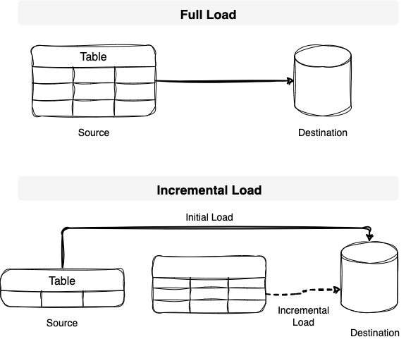

# Build Last Active User ETL pipeline

## Description: 
I have learn two ways to proceed the upsert method (insert + update) with last_active_user metric through python and SQL. It serves with different purpose depend on the destination source. For example, we want to transfers the executed result from last_active_user to db. Through python, we can use temp_table to extract the latest active and insert it into the table using SQL (INSERT INTO DO UPDATE). 


## **Bulk Load Vs Incremental Load**

Bulk Load is when you load everything into your destination. Meanwhile, incremental load process ususally divide into two parts:
- [Initial load or historical load](https://hevodata.com/learn/initial-load-vs-full-load-etl/)
- [Incremental load](https://www.stitchdata.com/etldatabase/etl-load/)




## Context:

As explain in the description, our purpose is to get the lastest info about customer info and their active hours. So, we need a pipeline that could give us the _UPDATED_ user with their lastest transaction. So, we need an initial load of the previous record of user transaction and then we will use the append or updated for the last transaction of the users. 

Customer_active_hour table                         |       Customer_info Table                |
-- | --
    |     


I want to get the metric of last_active_customer. So, the script would be: 

## 🛠 SQL Script:
```ruby
select
o.*,
last_online_date,
last_online_hours,
now()::timestamp as update_time


from public.customer_info o 

LEFT JOIN (
			SELECT
  		date,
			id,
 			max(date) over (partition by id) as last_online_date,
			online_hours as last_online_hours
			
			
			FROM customer_active_hour o1
		  WHERE id is not null
			group by id,date,online_hours
)t2 ON t2.id = o.id -- JOIN with customer_active_hour tbl record

WHERE last_online_date = date
order by id,date desc  

```

> **If the same customer who has been online in the following day, then the last_online_date column will be updated. Therefore, i just need to execute the following code below to set the condition of append (if there was a new user who online) and updated (if the same user are online in the new day)**

## 🛠 Code:

```ruby
import pandas as pd
import time
import psycopg2
import os 
from datetime import datetime


con = psycopg2.connect(
    host = 'db.bit.io',
    port = 5432,
    user = 'lhhorng',
    password = 'v2_427YJ_psP5ieRgM3hJva6yVaSAjbH',
    database='lhhorng/mydb2'
    )


print ("Database connected!")

cursor1 = con.cursor()

#from sqlalchemy import URL
sql = open ('etl_last_online_hour.sql','r')
sql_file = sql.read()

#Read sql query      

start_time = time.time()
cursor1.execute(sql_file)

print("to_sql duration: {} seconds".format(time.time() - start_time))


con.commit()
cursor1.close()
con.close()

```


